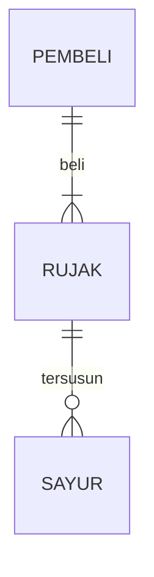

## 1.1 Latar Belakang

As I grew up, I played many 2D pixel games, because yk they didn't need high-end specs. Over time, I began to enjoy and appreciate how the games work as well as their visual style. I also started to like pixel art. Besides playing 2D games, I loved watching zombie-themed movies and series, which got me thinking – why not create my own 2D pixel zombie themed game? so here it is Keanu's Escape Odyssey : Infected Outbreak

## 1.2. Deksripsi Teknologi Informasi
"Keanu's Escape Odyssey: Infected Outbreak" is an 2D pixel art game that thrusts you into a world ravaged by Zombies. As Keanu, you'll navigate through the pixelated map, solve puzzles etc, all while surviving. Make choices that impact your fate and those of other survivors, escape the nightmare, and survive the infected apocalypse.

## 1.3. Branding

Merk    : Keanu's Escape Odyssey : Infected Outbreak 

Tagline : Survive, Solve, and Escape the Infected Outbreak with Keanu! 

Campaign : Join Keanu on a pixelated adventure like no other! In a world overrun by the infected, you'll need to strategize, solve puzzles, and fight your way through hordes of infected to escape the Outbreak

User Target :

    - Age 10+
    - 2d pixel game enthusiast
    - Pixel art enthusiast

User Experience theme :

    - Easy
    - Simple
    - Pixelated

Design inspiration :

## 2. User Story

As a | I want/need | So that | Priority
---|---|---|---
Player | Move my character | I can walk around | ⭐⭐⭐⭐⭐
Player | Pick a weapon | I can fight the enemy| ⭐⭐⭐⭐
Player | Explore the map | i can experience the excitment exploring in the zombie apocalypse | ⭐⭐⭐⭐⭐
Player | Solve a puzzle | I can escape the apocalypse| ⭐⭐⭐
Pixel art enthusiast | enjoy the pixel art of the game | I can enjoy the game even more | ⭐⭐⭐⭐
Player | Interact with npc | I can get a quest/objective | ⭐⭐⭐⭐
Player | a various maps | I don't get bored easly| ⭐⭐⭐
Player | Save game progress | Continue my progress | ⭐⭐⭐⭐

## 3. Struktur Data

Cara membuat aneka macam bentuk grafik menggunakan mermaid.js bisa lihat di [https://mermaid.js.org/syntax/entityRelationshipDiagram.html](https://mermaid.js.org/syntax/entityRelationshipDiagram.html) 

## 4. Arsitektur Sistem

Masih pake mermaid.js juga bisa lihat flowchart di [https://mermaid.js.org/syntax/flowchart.html](https://mermaid.js.org/syntax/flowchart.html)

## 5. Teknologi, Library, dan Framework

Godot 4
an open-source, cross-platform game engine and game development environment. It is known for its user-friendly interface, versatility, and the ability to create both 2D and 3D games. 

## 6. Desain User Experience dan User Interface

(https://interfaceingame.com/wp-content/uploads/stardew-valley/stardew-valley-journal-updated-500x281.png)

## 7. Demonstrasi Video

Link youtube nya

## 8. Bagaimana mesin komputasi dan sistem operasi berperan dalam produk teknologi informasimu ?

Link youtube nya di detik jawaban ini

## 9. Bagaimana algoritma, struktur data, dan bahasa pemrograman berperan dalam produk teknologi informasimu ?

Link youtube nya di detik jawaban ini

## 10. Bagaimana metode pengembangan perangkat lunak / Software Development Life Cycle berperan dalam produk teknologi informasimu ?

Link youtube nya di detik jawaban ini

## 11. Bagaimana database / sistem basis data berperan dalam produk teknologi informasimu ?

Link youtube nya di detik jawaban ini
